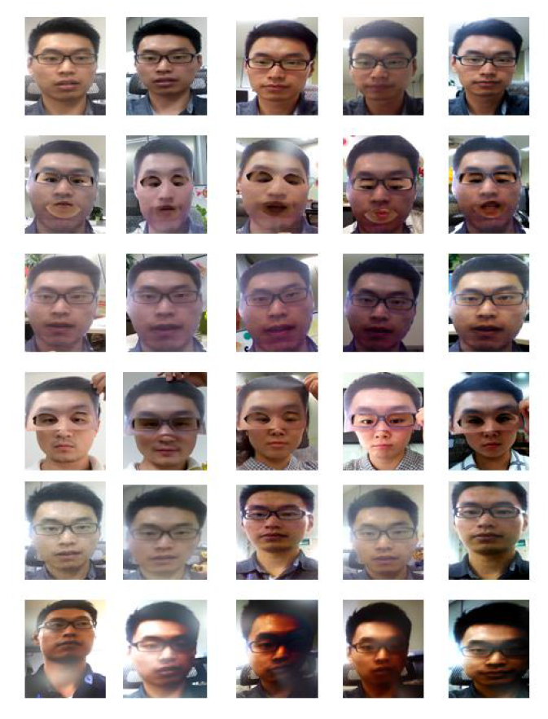

***Treeleaf AI Challenge 2020***

Liveness detection is a challenging task given the number of different
scenarios live HD fake video, lightning conditions,printed-photo attach,
replay attack, and 3-D mask attack and deep fakes. This
liveness detection uses the mtcnn to detect the face and then after
extracting the face , it uses the same frame to classify whether the
face is live or not. Further, the eyes are extracted from the face and
are checked if the eyes are closed and as per the competition guidelines
, they are marked non-live if both the eyes are found to be closed.

***Running the model:***

To run the model ,clone the code from the github, install the
required libraries . The required libraries are listed in the
requirement.txt file. To install all the requirements you can simply
type the following code in terminal of your IDE.

<!-- Github Markdown -->

<!-- Code Blocks -->
```bash
    pip install -r requirements.txt 

```
---------------------------------

For easier running of the model and proper evaluation I have written
some use friendly command line interface. You can read the help file by
running:

<!-- Github Markdown -->

<!-- Code Blocks -->
```bash
    python main.py -h

```

<!-- Code Blocks -->
```bash
Treeleaf Liveness Detection

optional arguments:
  -h, --help            show this help message and exit
  -f {True,False}, --showFps {True,False}
                        Choose weather to show the average frame per second or
                        not
  -v {0,1,2}, --videoSource {0,1,2}
                        Choose the video source to start the liveness
                        detection 
                        0: For the primary webcam
                        1: For the secondary webcam 
                        2:To select the file from computer
  -p VIDEOPATH, --videoPath VIDEOPATH
                        path to the video
  -s {1,2,3,4,5}, --stride {1,2,3,4,5}
                        Increase the FPS by striding
  -c {True,False}, --saveVideo {True,False}
                        Set true to save the ouput video
  -d {True,False}, --showAll {True,False}
                        If False it only shows the images in which human faces
                        are present and if True shows all the frames
```
                                

All the arguments are optional so if you want to run the model through
the webcam with the basic setting you can simply run
<!-- Code Blocks -->
```bash
    python main.py

```
To show the fps you can run the main.py as
<!-- Code Blocks -->
```bash
    python main.py -f True

```
  

You can also use multiple settings from the given argument. For example
<!-- Code Blocks -->
```bash
    python main.py -f True -v 0 -s 2 -d True

```

Note that the **stride** argument used for increasing the fps may decrease the
accuracy of bounding box.The algorithm used is a strided modification 
in which face detection is performed on only every N frames, and
applied to all frames. For example, with a batch of 9 frames, we could
pass frames 0, 3, and 6 to MTCNN. Then, the bounding boxes (and
potentially landmarks) returned for frame 0 would be naively applied to
frames 1 and 2. Similarly, the detections for frame 3 are applied to
frames 4 and 5, and the detections for frames 6 are applied to frames 7
and 8.

Also note that this model is made to freeze till the face is detected in
the given video frame , as was instructed to ignore the non face object.
you can set showAll to True to show all the frames

Please choose the command line interface as per your need.

For training the model, different datasets are used. These datasets are
basically used to extract the face or eyes which is the subject of our
interest. These datasets are publicly available for download. For ROSE-
youtu dataset you have to send an email and they provide you the access
after a day or two.

**The datasets used for the liveness detection are:**

1)[*ROSE-Youtu Face Liveness Detection
Dataset*](http://rose1.ntu.edu.sg/datasets/faceLivenessDetection.asp)

2)[*Closed Eyes In The Wild (CEW)
Dataset*](http://parnec.nuaa.edu.cn/_upload/tpl/02/db/731/template731/pages/xtan/ClosedEyeDatabases.html)

3)Personal Dataset(for improvisation as the Rose-youtu dataset only
contained people of chinese origin)

1)[*ROSE-Youtu Face Liveness Detection
Dataset*](http://rose1.ntu.edu.sg/datasets/faceLivenessDetection.asp)

The ROSE-Youtu Face Liveness Detection Database (ROSE-Youtu) consists of
4225 videos with 25 subjects in total (3350 videos with 20 subjects
publically available with 5.45GB in size).For each subject, there are
150-200 video clips with the average duration around 10 seconds. Five
mobile phones were used to collect the database: (a) Hasee smart-phone
(with resolution of 640 \* 480), (b) Huawei Smart-phone (with resolution
of 640 \* 480), (c) iPad 4 (with resolution of 640 \* 480), (d) iPhone
5s (with resolution of 1280 \* 720) and (e) ZTE smart-phone (with
resolution of 1280 \* 720). All face videos are captured by a
front-facing camera. The standoff distance between face and camera is
about 30-50 cm.For genuine face video, normally there are 25 videos (5
devices with 5 scenes). The scene covers 5 different illumination
conditions in office environment. If the client wears eye-glasses, there
will be another 25 videos.

Three spoofing attack types including printed paper attack, video replay
attack, and masking attack. For printed paper attack, face image with
still printed paper and quivering printed paper (A4 size) are used. For
video replay attack, we display a face video on Lenovo LCD screen and
Mac screen. For masking attack, masks with and without cropping are
considered.
<!--Images-->



These videos are recorded from a total of 20 persons in MP4 format. The
naming template of each mp4 is L\_S\_D\_x\_E\_p\_N (seven sections
connected with ‘\_’). Each section is introduced as follows:

1\. The first section ‘L’ could by any one of the follow 9 strings:

> 1\) G - ‘G’ indicates a genuine person.
>
>2\) Ps - ‘Ps’ indicates a still printed paper.
>
>3\) Pq - ‘Pq’ indicates a quivering printed paper.
>
>4\) Vl - ‘Vl’ indicates a video which records a lenovo LCD display.
>
>5\) Vm - ‘Vm’ indicates a video which records a Mac LCD display.
>
>6\) Mc - ‘Mc’ indicates a paper mask with two eyes and mouth cropped out.
>
>7\) Mf - ‘Mf’ indicates a paper mask without cropping.
>
>8\) Mu - ‘Mu’ indicates a paper mask with the upper part cut in the
>middle.
>
>9\) Ml - ‘Ml’ indicates a paper mask with the lower part cut in the
>middle.

2\. The second section ‘S’ could be any one of the follow 2 strings:

> 1\) T - ‘T’ indicates the subject is speaking when recording.
>
> 2\) NT - ‘NT’ indicates the subject is not speaking when recording.

3\) The third section ‘D’ indicates the devices recording the videos, and
it could be any one of the follow 5 strings:

> 1\) HS - ‘HS’ indicate the video is recorded by a Hasee smart-phone.
>
> 2\) HW - ‘HW’ indicate the video is recorded by a Huawei smart-phone.
>
> 3\) IP - ‘IP’ indicate the video is recorded by an
> Ipad.{width="3.3854166666666665in"
> height="4.027450787401575in"}
>
> 4\) 5s - ‘5s’ indicate the video is recorded by an Iphone 5s.
>
> 5\) ZTE - ‘ZTE ’indicate the video is recorded by a ZTE smart-phone.

4．The fourth section ‘X’ indicates whether the subject is wearing
eyeglasses, and it could be any one of the follow 2 strings:

> 1\) g - ‘g’ indicates the subjects is wearing glasses.
>
> 2\) wg - ‘wg’ indicates the subjects is not wearing glasses.

5．The fifth section ‘E’ indicates the background environment when the
video is recorded. This section is reserved and has not been set yet.

6．The section ‘p’ indicates the person ID.

7．The last section ‘N’ indicate the file index number.

2)[*Closed Eyes In The Wild (CEW)
Dataset*](http://parnec.nuaa.edu.cn/_upload/tpl/02/db/731/template731/pages/xtan/ClosedEyeDatabases.html)

Eye closeness detection is a challenging task in the unconstrained
real-world application scenario which is full of challenging variations
caused by individual difference and kinds of environment changes
including lighting, blur, occlusion, and disguise. To investigate the
performance of eye closeness detection in these conditions, we collected
a dataset for eye closeness detection in the Wild. In particular, this
dataset contains 2423 subjects, among which 1192 subjects with both eyes
closed are collected directly from Internet, and 1231 subjects with eyes
open are selected from the Labeled Face in the Wild (LFW \[2\])
database. Eye patches are collected based on the coarse face region and
eye position automatically and respectively estimated by the face
detector\[3\] and eye localization\[4\]. We first resize the cropped
coarse faces to the size 100×100 (pixels) and then extract eye patches
of 24×24 centered at the localized eye position. Illustration of faces
images in this dataset can be seen in Figure 1.

3)*Personal dataset* :

Video of around 20 people is taken for an average of 10 sec . For each
person there are 3 videos , one when the eyes are closed , eyes open and
the video of them in mobile or the printed photo. Then the faces and
eyes are extracted from the video using the MTCNN.

I have shared the zip file containing all the extracted faces from all
these
[*dataset*](https://drive.google.com/file/d/1eSh399jNkTCqggIkzM3HC2XWnZc8ZcM6/view?usp=sharing)
.
